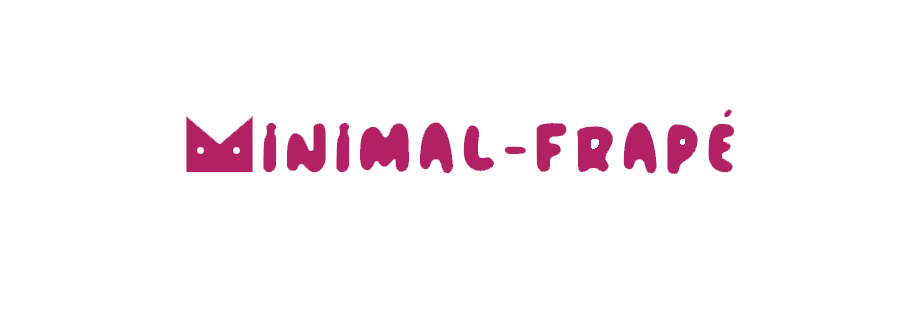
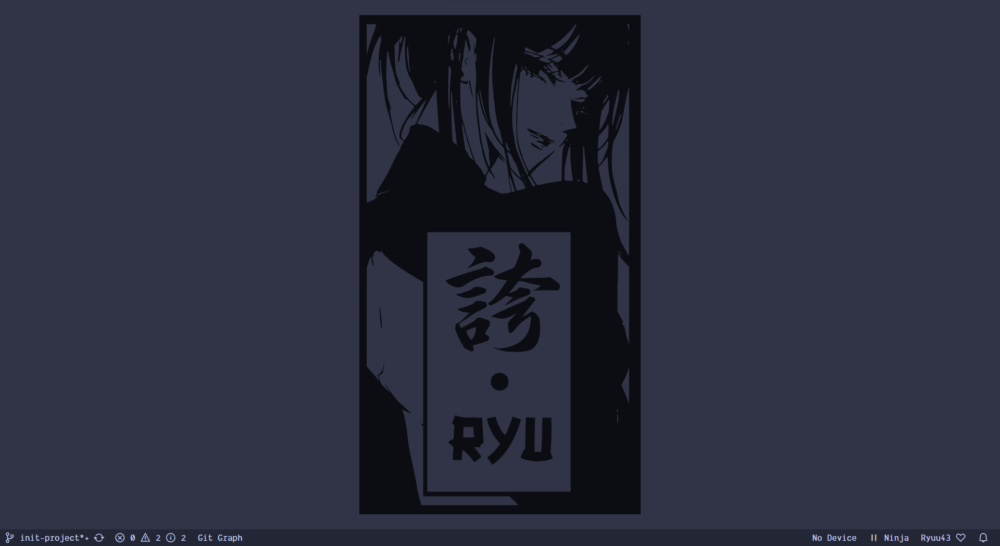
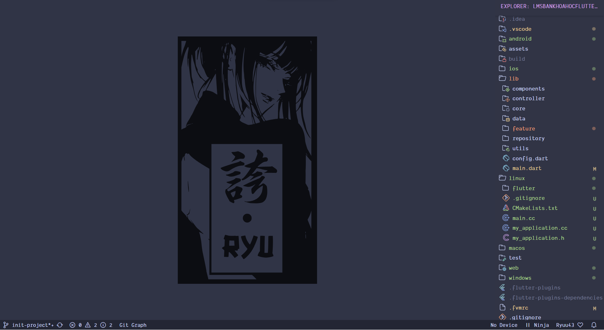
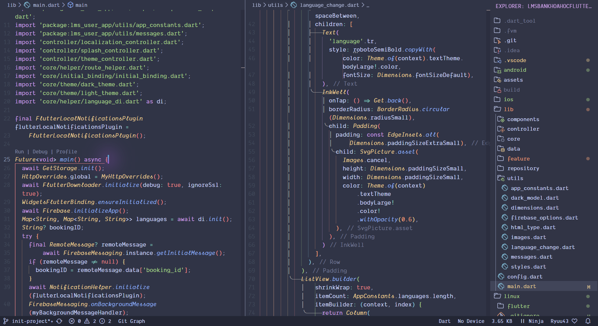
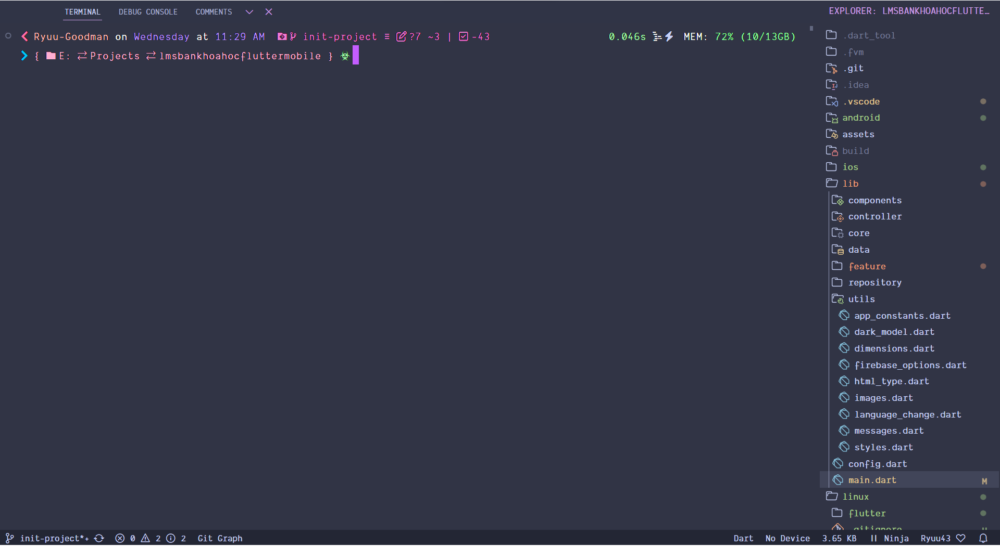
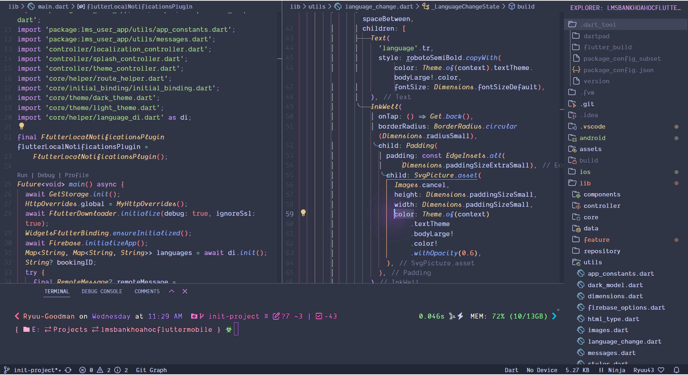
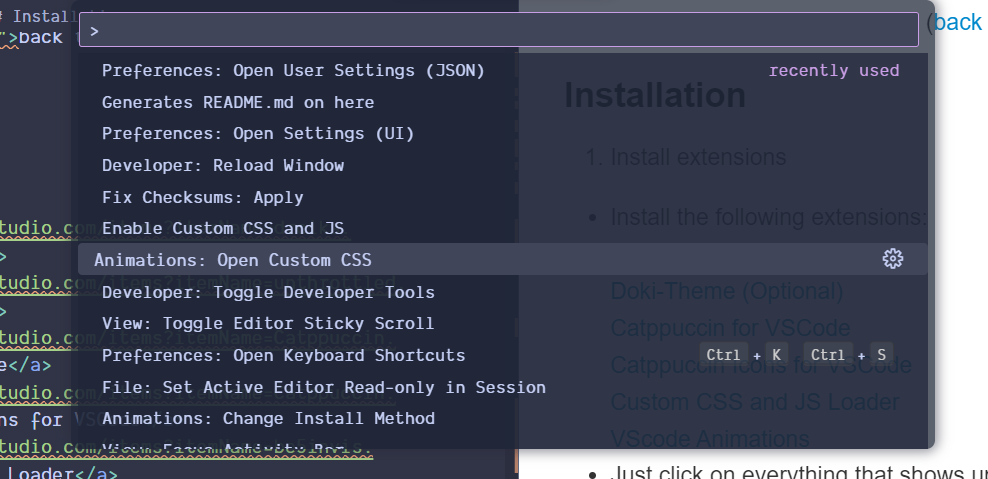

<!-- PROJECT LOGO -->
 

  

  <h3 align="center">minimal-frapé</h3>

  

    A clean and minimalistic user interface for your vscode with catpputccin frapé theme
     
    <a href="https://github.com/Ryuu43/minimal-frape"><strong>Explore the docs »</strong></a>
     
     
    <a href="#demo">View Demo</a>
    ·
    <a href="https://github.com/Ryuu43/minimal-frape/issues/new/choose">Report Bug</a>
    ·
    <a href="https://github.com/Ryuu43/minimal-frape/issues/new?labels=enhancement&template=feature-request---.md">Request Feature</a>
  

<!-- TABLE OF CONTENTS -->

  
Table of Contents

  <ol>
    <li>
      <a href="#about-the-project">About The Project</a>
    </li>
    <li><a href="#installation">Installation</a></li>
    <li><a href="#usage">Usage</a></li>
    <li><a href="#contact">Contact</a></li>
  </ol>

<!-- ABOUT THE PROJECT -->

## About The Project

  
  

This project showcases the ability to customize Visual Studio Code (VS Code) setup, tailored to improve my productivity and make my coding environment more personal and productive. By modifying themes, extensions, keybindings and settings to be as minimalistic as possible but not too much

### View Demo

🐱DEMO

 <tr>
  <td></td>
   
  <td></td>
   
  <td></td>
   
  <td></td>
   
  <td></td>
 </tr>

(<a href="#readme-top">back to top</a>)

### Installation

1. Install extensions

- Install the following extensions:
  <a href="https://marketplace.visualstudio.com/items?itemName=drcika.apc-extension">Apc Customize UI++</a>
  <a href="https://marketplace.visualstudio.com/items?itemName=unthrottled.doki-theme">Doki-Theme (Optional)</a>
  <a href="https://marketplace.visualstudio.com/items?itemName=Catppuccin.catppuccin-vsc">Catppuccin for VSCode</a>
  <a href="https://marketplace.visualstudio.com/items?itemName=Catppuccin.catppuccin-vsc-icons">Catppuccin Icons for VSCode</a>
  <a href="https://marketplace.visualstudio.com/items?itemName=be5invis.vscode-custom-css">Custom CSS and JS Loader</a>
  <a href="https://marketplace.visualstudio.com/items?itemName=BrandonKirbyson.vscode-animations"> VScode Animations</a>

- Just click on everything that shows up in the notification panel after installing those extensions :3

2. Import css

- Copy the My "custom ui section" of the settings.json file into the last line of your settings.json
- About customizing the welcome screen. After you install all the extensions open Command Palette and choose Animations: Open custom CSS and paste css into it
<!-- USAGE EXAMPLES -->

## Usage

If you like it, feel free to use it, it's customizable

(<a href="#readme-top">back to top</a>)

<!-- CONTACT -->

## Contact

Ryuu43 - [@Ryuu43Dev](https://x.com/Ryuu43Dev) - <ryuu43.dev@gmail.com>

Project Link: [https://github.com/your_username/repo_name](https://github.com/your_username/repo_name)

(<a href="#readme-top">back to top</a>)

<!-- MARKDOWN LINKS & IMAGES -->
<!-- https://www.markdownguide.org/basic-syntax/#reference-style-links -->
